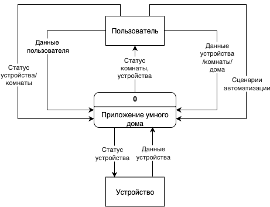
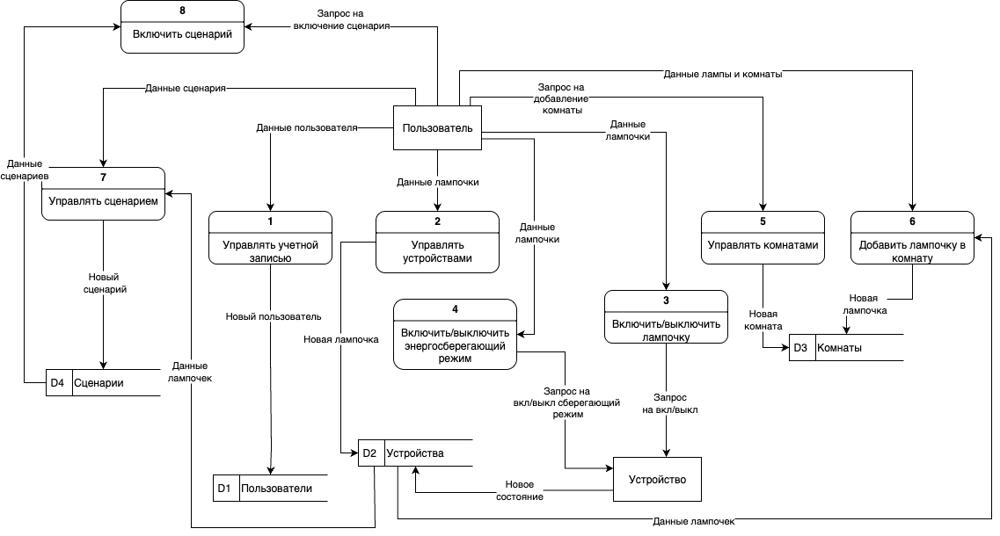
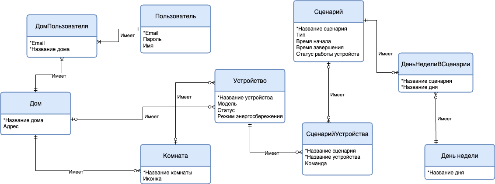

# SmartHome
Спроектировать и разработать приложение для управления умным домом, обеспечивающее удобный контроль за устройствами, автоматизацию сценариев. На первом этапе выполнены сбор требований, анализ бизнес-процессов и проектирование архитектуры системы.
В данном репозитории продемонстрированны DFD-диаграммы контекстного и логического уровня, а так же логическая ER-диаграмма.

## DFD-диаграмма(контекстная)

## DFD-диаграмма(логическая)

Это DFD-диаграмма (логическая), отображающая логику управления системой «умного дома» с акцентом на управление учетными записями, устройствами, комнатами и сценариями.
### Краткое описание:
 - Пользователь — основной внешний источник запросов (включение ламп, управление комнатами и сценариями).

🧾 Основные процессы:

 - Управление учетной записью (создание нового пользователя).
 - Управление устройствами (добавление/редактирование лампочек).
 - Включение/выключение лампочки.
 - Включение/выключение энергосберегающего режима.
 - Управление комнатами.
 - Добавление лампочки в комнату.
 - Управление сценариями.
 - Включение сценария.

🔗 Хранилища данных:

 - D1 — Пользователи.
 - D2 — Устройства.
 - D3 — Комнаты.
 - D4 — Сценарии.

Каждый процесс обменивается данными с пользователем, устройствами и базами данных, обеспечивая гибкое управление системой умного дома.

## ER-диаграмма(логическая)

🗂 Словарь данных:

| Элемент данных       | Описание                                              | Тип данных | Длина | Пример значения                        |
|----------------------|-------------------------------------------------------|------------|--------|----------------------------------------|
| ID дома              | Уникальный идентификатор дома                         | INT        | 11     | 1                                      |
| Название дома        | Название дома                                         | VARCHAR    | 100    | "Мой дом"                              |
| Адрес                | Адрес дома                                            | VARCHAR    | 255    | "ул. Пушкина, д. 10"                   |
| ID пользователя      | Уникальный идентификатор пользователя                 | INT        | 11     | 1                                      |
| Email                | Электронная почта пользователя                        | VARCHAR    | 100    | "user@example.com"                     |
| Пароль               | Пароль пользователя                                   | VARCHAR    | 255    | "qwertyuiop123"                        |
| ФИО                  | ФИО пользователя                                      | VARCHAR    | 255    | "Иванов Иван Иванович"                |
| ID комнаты           | Уникальный идентификатор комнаты                      | INT        | 11     | 1                                      |
| Название комнаты     | Название комнаты                                      | VARCHAR    | 100    | "Гостиная"                             |
| Иконка               | Иконка комнаты (ссылка на изображение)                | VARCHAR    | 255    | "icon_living_room.png"                |
| ID устройства        | Уникальный идентификатор устройства                   | INT        | 11     | 1                                      |
| Название устройства  | Название устройства                                   | VARCHAR    | 100    | "Лампочка в прихожей"                 |
| Модель               | Модель устройства                                     | VARCHAR    | 100    | "Stets X3"                             |
| Статус               | Статус устройства                                     | BOOLEAN    | -      | "on" / "off" ("1" / "0")              |
| ID сценария          | Уникальный идентификатор сценария                    | INT        | 11     | 1                                      |
| Название сценария    | Название сценария                                     | VARCHAR    | 100    | "Доброе утро"                          |
| Тип                  | Тип сценария (ручной или по расписанию)               | BOOLEAN    | -      | "по расписанию" / "ручной" ("1"/"0") |
| Расписание           | Расписание выполнения сценария (если тип = по расписанию) | TEXT   | -      | {"type": "daily", "time": "08:00"}    |
| Команда              | Действие, выполняемое устройством в сценарии         | VARCHAR    | 50     | "включить"                             |

